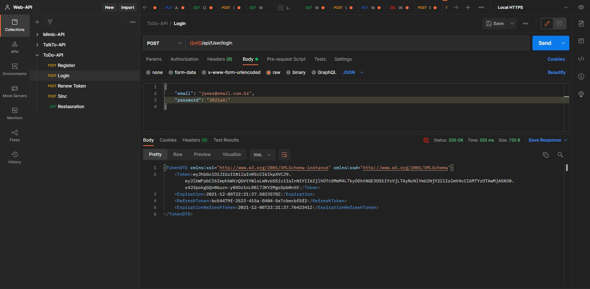

# ToDoAPI - A To Do List API, developed in Udemy REST API classes

<h3>A Restfull API serving web and mobile developed on .Net 5 using C#<h3>

<h3>Postman tests 🖥️</h3>
</img>
 
</img>
 
</img>
 
</img>
 

<h3>Overview ⮯</h3>

The REST API is based on a To Do App, serving web/mobile, this is a log-in and back-up api, who serve to preserve the user data, and update if needed, the login system comes with a JWT Token Validation with refresh for data security, and the user can, synchronize all the data between the local instance and the server database, also contains content-negociation to be delivered with XML and JSON format, as the final user/client prefers.

 
<h3>This project has concepts like :<h3>
<ul>
  <li>Totally RESTFULL API ⬇</li>
  <li>JWT Token Validation on Log-in (with Token refresh) 🔧</li>
  <li>A Backup API ⬇</li>
  <li>Use of Swagger for the documentation, facilitating the client manipulation 🔧</li>
</ul>
 
<h3>How to run ⮯</h3>

You just need to git clone the project do the migrations for the 
  database update and set the url to your on localhost gate, to set the environment ready to run, and the most important, HAVE FUNN !🧑

ATT: 30/11/2021 - 👨‍💻 João Vítor Carvalho

<em>'This project has no commercial purposes, it was carried out only for the application of my studies'📚</em>

<strong>----João Vítor Carvalho 👨‍💻 ---</strong>
